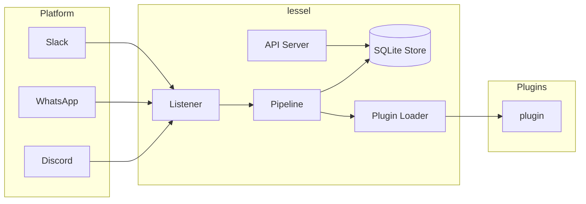

<!-- Created with GitHub Repo Banner by Waren Gonzaga: https://ghrb.waren.build -->


**lessel** (from "vessel") is a general-purpose, open-source message pipeline framework. It connects to platforms like **Discord**, **WhatsApp**, and **Slack**, listens for messages that match your rules, stores them, and exposes them through a REST API for your own executers (plugins) to process.

---

## Table of Contents

- [Features](#features)
- [Architecture](#architecture)
- [Install](#install-via-npm-no-clone-needed)
- [Quick Start](#quick-start)
- [Tutorial](#tutorial-discord--whatsapp)
- [API Endpoints](#api-endpoints)
- [Plugins](#plugins)
- [Ecosystem](#ecosystem)
- [Project Structure](#project-structure)
- [Documentation](#documentation)
- [Contributing](#contributing)
- [License](#license)

---

## Features

- **Platform-agnostic** — Discord, WhatsApp, Slack supported out of the box
- **Schema-based filtering** — Define what messages to capture using simple JSON rules
- **SQLite storage** — Zero-config persistence. No external database needed
- **API Key authentication** — Secure REST API with rate limiting and timing-safe key validation
- **Plugin system** — Install `@lessel/plugin-*` packages that run inside the pipeline
- **Cross-platform sends** — One plugin can send to any platform via `context.send()`
- **Extensible** — Build your own listeners, senders, and plugins via interfaces

---

## Architecture



### LES Framework

- **Listener** — Connects to a platform (Discord, WhatsApp, etc.) and ingests messages as `MessageEvent` objects
- **Executer (Plugin)** — Code that runs inside the pipeline when a message matches a schema. Could be an AI bot, a logging system, a notification service, etc
- **Sender** — Sends processed data back to platforms (e.g., post to WhatsApp)

---

## Plugin Registry

lessel has a community plugin registry powered by GitHub. Browse, search, and install plugins:

```bash
# Search available plugins
npx lessel plugin search sentiment

# Install a plugin
npx lessel plugin install example-logger

# Prepare your plugin for publishing
npx lessel plugin publish ./path/to/plugin
```

**Browse the registry:** [https://terminay.github.io/lessel-plugins](https://terminay.github.io/lessel-plugins)

**Submit plugins via PR:** [https://github.com/Terminay/lessel-plugins](https://github.com/Terminay/lessel-plugins)

---

## Install via npm (no clone needed)

```bash
# Recommended: install the meta-package
npm install lessel-kit
```

This installs:
- `@lessel/core` — pipeline engine, store, API server
- `@lessel/listener-discord` — Discord listener
- `@lessel/listener-slack` — Slack listener
- `@lessel/listener-whatsapp` — WhatsApp listener
- `@lessel/sender-discord` — Discord sender
- `@lessel/sender-slack` — Slack sender
- `@lessel/sender-whatsapp` — WhatsApp sender
- `@lessel/cli` — command-line tool

**Note:** Plugins are NOT included. Install them separately:
```bash
npm install @lessel/plugin-logger
```

Or use the CLI directly without installing:
```bash
npx @lessel/cli init        # scaffolds lessel.config.json + .env
npx @lessel/cli start       # starts the pipeline + API
npx @lessel/cli plugin add @lessel/plugin-logger
```

---

## Quick Start

### Prerequisites

- Node.js >= 18
- npm

### Installation

```bash
git clone https://github.com/Terminay/lessel.git
cd lessel
npm install
```

### Configuration

1. Copy the example environment file:
   ```bash
   cp .env.example .env
   ```

2. Fill in your Discord bot token:
   ```
   DISCORD_BOT_TOKEN=your_discord_bot_token_here
   ```

3. Create `lessel.config.json`:
   ```json
   {
     "port": 3100,
     "schemas": [
       {
         "name": "all-messages",
         "platforms": ["discord"],
         "filters": [],
         "extract": [
           { "key": "content", "path": "content" },
           { "key": "author", "path": "authorName" }
         ],
         "store": true
       }
     ],
     "plugins": ["@lessel/plugin-logger"]
   }
   ```

### Run

```bash
npm run build
npm start
```

Lessel will start the Discord listener and the API server at `http://localhost:3100`.

---

## API Endpoints

| Endpoint | Auth | Description |
|---|---|---|
| `GET /health` | No | Health check |
| `GET /stats` | Yes | Dashboard statistics |
| `GET /schemas` | Yes | List all schemas |
| `GET /messages` | Yes | Retrieve stored messages |
| `GET /messages?schema=...&platform=...` | Yes | Filter messages |
| `GET /messages/stream?since=ISO8601` | Yes | Poll new messages |
| `POST /admin/keys` | Yes | Create a new API key |
| `GET /admin/keys` | Yes | List API keys |

All protected endpoints require a `Bearer` token:
```
Authorisation: Bearer lsl_<your_api_key>
```

---

## Plugins

lessel plugins (`@lessel/plugin-*`) are executers that run **inside** the pipeline — no external server or polling needed.

```javascript
// my-plugin.js
module.exports = {
  name: 'my-plugin',
  schema: 'all-messages',     // which schema to hook into
  async execute(event, context) {
    // event.payload  — extracted fields
    // context.store  — direct SQLite access
    // context.log    — logging helper
    // context.send   — send to any platform
  }
};
```

Register in `lessel.config.json`:
```json
{ "plugins": ["./my-plugin.js"] }
```

Or install published plugins: `npx @lessel/cli plugin add @lessel/plugin-logger`

---

## Ecosystem

| Package | npm | Description |
|---|---|---|
| `lessel-kit` | `npm install lessel-kit` | Meta-package with all platforms |
| `@lessel/core` | `npm install @lessel/core` | Pipeline engine, store, API server |
| `@lessel/listener-discord` | `npm install @lessel/listener-discord` | Discord listener |
| `@lessel/listener-slack` | `npm install @lessel/listener-slack` | Slack listener |
| `@lessel/listener-whatsapp` | `npm install @lessel/listener-whatsapp` | WhatsApp listener |
| `@lessel/sender-discord` | `npm install @lessel/sender-discord` | Discord sender |
| `@lessel/sender-slack` | `npm install @lessel/sender-slack` | Slack sender |
| `@lessel/sender-whatsapp` | `npm install @lessel/sender-whatsapp` | WhatsApp sender |
| `@lessel/cli` | `npm install @lessel/cli` | CLI tool |
| `@lessel/plugin-logger` | `npm install @lessel/plugin-logger` | Example plugin |

---

## Project Structure

```
packages/
  core/              # @lessel/core
    listener/        # IListener interface
    api/             # REST API server
    store/           # SQLite persistence
    pipeline/        # Pipeline orchestrator
    plugin/          # Plugin loader
  listener-discord/  # @lessel/listener-discord
  listener-slack/    # @lessel/listener-slack
  listener-whatsapp/ # @lessel/listener-whatsapp
  sender-discord/    # @lessel/sender-discord
  sender-slack/      # @lessel/sender-slack
  sender-whatsapp/   # @lessel/sender-whatsapp
  cli/               # @lessel/cli (npx @lessel/cli init/start/plugin)
  plugin-logger/     # @lessel/plugin-logger (example)
  lessel-kit/        # lessel-kit meta-package
```

---

## Documentation

- [Getting Started](https://terminay.github.io/lessel/docs/guides/getting-started)
- [Your First Plugin](https://terminay.github.io/lessel/docs/guides/your-first-plugin)
- [Sending Messages](https://terminay.github.io/lessel/docs/guides/sending-messages)
- [Understanding Schemas](https://terminay.github.io/lessel/docs/guides/schemas)
- [Configuration Reference](https://terminay.github.io/lessel/docs/guides/configuration)
- [CLI Reference](https://terminay.github.io/lessel/docs/guides/cli)
- [API Reference](https://terminay.github.io/lessel/docs/api-reference)

---

## Contributing

We welcome contributions! Please see our [Contributing Guide](CONTRIBUTING.md) for details on:

- Development setup
- Coding guidelines
- Pull request process
- Documentation generation

Also review the [Code of Conduct](CODE_OF_CONDUCT.md) and [Security Policy](SECURITY.md).

---

## License

[MIT](LICENSE)
