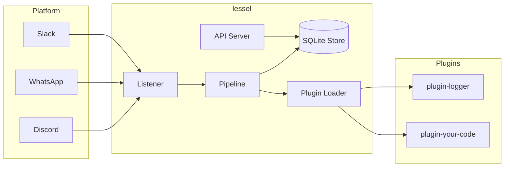

# lessel

**lessel** (from "vessel") is a general-purpose, open-source message pipeline framework. It connects to platforms like **Discord**, **WhatsApp**, and **Slack**, listens for messages that match your rules, stores them, and exposes them through a REST API for your own executers (plugins) to process.

---

## Table of Contents

- [Features](#features)
- [Architecture](#architecture)
- [Install](#install-via-npm-no-clone-needed)
- [Quick Start](#quick-start-from-source)
- [API Endpoints](#api-endpoints)
- [Plugins](#plugins)
- [Project Structure](#project-structure)
- [Contributing](#contributing)
- [License](#license)

---

## Features

- **Platform-agnostic** — Discord listener built-in. WhatsApp & Slack coming soon.
- **Schema-based filtering** — Define what messages to capture using simple JSON rules.
- **SQLite storage** — Zero-config persistence. No external database needed.
- **API Key authentication** — Secure REST API for your external executers.
- **Plugin system** — Install `@lessel/plugin-*` packages that run inside the pipeline. No external hosting.
- **Extensible** — Build your own listeners, senders, and plugins via interfaces.

---

## Architecture



### LES Framework

- **Listener** — Connects to a platform (Discord, WhatsApp, etc.) and ingests messages as `MessageEvent` objects.
- **Executer (Plugin)** — Code that runs inside the pipeline when a message matches a schema. Could be an AI bot, a logging system, a notification service, etc.
- **Sender** — *(Future)* Sends processed data back to platforms (e.g., post to WhatsApp).

---

## Install via npm (no clone needed)

```bash
# Recommended: use the CLI directly
npx @lessel/cli init        # scaffolds lessel.config.json + .env
# edit .env and set DISCORD_BOT_TOKEN
npx @lessel/cli start       # starts the pipeline + API
npx @lessel/cli plugin add @lessel/plugin-logger
```

Or install as library dependencies:

```bash
npm install @lessel/core @lessel/listener-discord @lessel/cli
```

---

## Quick Start (from source)

### Prerequisites

- Node.js >= 18
- npm

### Installation

```bash
git clone https://github.com/Terminay/lessel.git
cd listener-bot
npm install
```

### Configuration

1. Copy the example environment file:
   ```bash
   cp .env.example .env
   ```

2. Fill in your Discord bot token:
   ```
   DISCORD_BOT_TOKEN=your_discord_bot_token_here
   ```

3. (Optional) Configure schemas/plugins in `lessel.config.json`:
   ```json
   {
     "schemas": [
       {
         "name": "all-messages",
         "platforms": ["discord"],
         "filters": [],
         "extract": [
           { "key": "content", "path": "content" },
           { "key": "author", "path": "authorName" }
         ],
         "store": true
       }
     ],
     "plugins": []
   }
   ```

### Run

```bash
npm run build
npm start
```

lessel will start the Discord listener and the API server at `http://localhost:3100`.

---

## API Endpoints

| Endpoint | Auth | Description |
|---|---|---|
| `GET /health` | No | Health check |
| `GET /stats` | Yes | Dashboard statistics |
| `GET /schemas` | Yes | List all schemas |
| `GET /messages` | Yes | Retrieve stored messages |
| `GET /messages?schema=...&platform=...` | Yes | Filter messages |
| `GET /messages/stream?since=ISO8601` | Yes | Poll new messages |
| `POST /admin/keys` | Yes | Create a new API key |
| `GET /admin/keys` | Yes | List API keys |

All protected endpoints require a `Bearer` token:
```
Authorization: Bearer lsl_<your_api_key>
```

---

## Plugins

lessel plugins (`@lessel/plugin-*`) are executers that run **inside** the pipeline — no external server or polling needed.

```javascript
// my-plugin.js
module.exports = {
  name: 'my-plugin',
  schema: 'all-messages',     // which schema to hook into
  async execute(event, context) {
    // event.payload  — extracted fields
    // context.store  — direct SQLite access
    // context.log    — logging helper
  }
};
```

Register in `lessel.config.json`:
```json
{ "plugins": ["./my-plugin.js"] }
```

Or install published plugins: `npx @lessel/cli plugin add @lessel/plugin-logger`

---

## Project Structure

```
packages/
  core/              # @lessel/core
    listener/        # IListener interface
    api/             # REST API server
    store/           # SQLite persistence
    pipeline/        # Pipeline orchestrator
    plugin/          # Plugin loader
  listener-discord/  # @lessel/listener-discord
  plugin-logger/     # @lessel/plugin-logger (example)
  cli/               # @lessel/cli (npx @lessel/cli init/start/plugin)
  sender-whatsapp/   # @lessel/sender-whatsapp (future)
```

---

## Contributing

We welcome contributions! Please see our [Contributing Guide](CONTRIBUTING.md) for details on:

- Development setup
- Coding guidelines
- Pull request process
- Documentation generation

Also review the [Code of Conduct](CODE_OF_CONDUCT.md) and [Security Policy](SECURITY.md).

---

## License

MIT